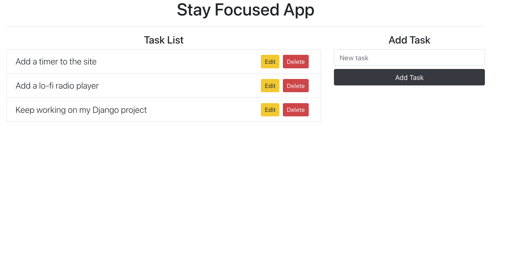

### Get Focused App

Welcome to Get focused App, a simple to-do list that will make you get things done

### Technologies Used

* HTML5
* CSS3
* JavaScript
* React
* Node.js
* Express
* MongoDB and Mongoose

### Screenshots

### Links

* [www.StayFocused.fm](https://stayfocused.fm/)
* [Backend Repo](https://github.com/rallao/ga-project3-backend)

### Getting Started

* Go to [www.StayFocused.fm](https://stayfocused.fm/)
* Add the task thats need to be done
* Use Delete or Edit

